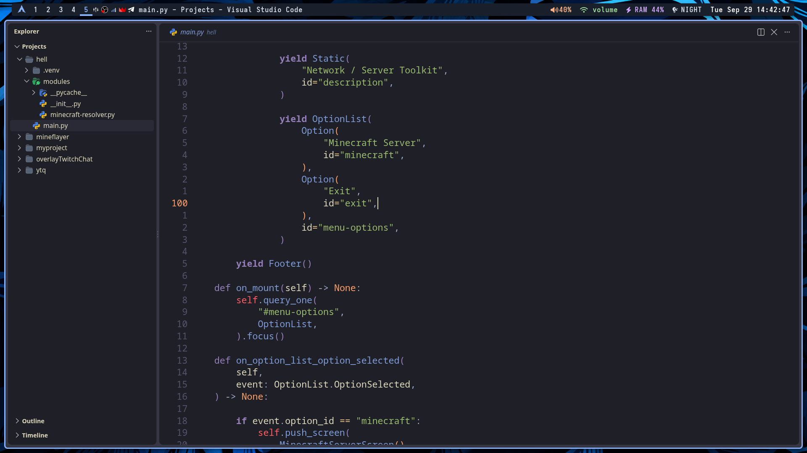

<div align="center">

# TheodoreVAC · i3 dotfiles

Arch Linux · X11 · i3 · Polybar

[English](README.md) | **Русский**

</div>



Моя конфигурация рабочего стола i3 с тёмной темой. Репозиторий содержит конфиги, установщик и используемые шрифты. Пакетные списки, снимки установленных программ и системный инвентарь сюда не входят.

## Содержание

- [Что настроено](#что-настроено)
- [Установка](#установка)
- [Сочетания клавиш](#сочетания-клавиш)
- [Заметки](#заметки)
- [Лицензия](#лицензия)

## Что настроено

- **i3**: сочетания клавиш, раскладка US/RU, автоматическая ориентация тайлов и запуск приложений.
- **Обои**: `Super+Shift+B` открывает сетку с крупными миниатюрами изображений из `~/Wallpapers` (3 колонки, картинка во всю карточку, превью-кроп кэшируется в `~/.cache/wallpaper-thumbs`); выбранная картинка применяется сразу и восстанавливается при запуске i3. Папку с обоями нужно перенести отдельно: изображения в репозиторий не входят.
- **Polybar**: рабочие столы, заголовок окна, раскладка клавиатуры, звук, сеть, дата и счётчик уведомлений с переключателем «Не беспокоить».
- **Уведомления**: dunst в стиле темы — тёмные карточки под панелью, скругления, рамка по срочности (голубая/серая/розовая), полоса прогресса, иконки Papirus. История открывается в Rofi (`Super+N`) с копированием, очисткой и повтором последнего уведомления. Громкость и микрофон показываются полосой OSD, а скриншоты — уведомлением с превью.
- **Rofi, Picom, Dunst, Alacritty, Yazi, GTK и Fastfetch.**
- **Zsh** с Oh My Zsh, Powerlevel10k и алиасами `eza`.
- **X11**: `.xinitrc` и `.Xresources`.

## Установка

### 1. Клонируем репозиторий

```bash
git clone https://github.com/TheodoreVAC/.dotfiles-i3wm.git ~/dotfiles
cd ~/dotfiles
```

### 2. Ставим конфиги и шрифты

```bash
./install.sh
```

Выберите пункт:

| Пункт | Что делает |
|---|---|
| `1` | Подключает все конфиги из репозитория симлинками в `$HOME` и ставит шрифты |
| `2` | Предпросмотр — печатает план, ничего не меняя |
| `3` | Устанавливает недостающие пакеты (dunst, rofi, jq, плагины Zsh и т.д.), только после вашего подтверждения |
| `q` | Выход |

Существующие файлы сохраняются рядом с исходным путём как `*.pre-dotfiles.<дата-время>` и затем заменяются символическими ссылками на файлы репозитория. Шрифты копируются в `~/.local/share/fonts`.

Установщик не трогает `/etc`; шаг с пакетами выполняется только если вы явно выбрали пункт `3`.

Шаги можно запускать и по отдельности:

```bash
./scripts/install-configs.sh          # подключить конфиги (флаг --dry-run — предпросмотр)
./scripts/install-deps.sh             # проверить и доставить недостающие пакеты
./scripts/install-deps.sh --check     # только проверить (код 1, если чего-то нет)
```

### 3. После установки

1. Перезапустите сессию i3 (`Super+Shift+r`), чтобы конфиги перечитались.
2. Положите свои обои в `~/Wallpapers`: без них пикер покажет сообщение об пустой папке, а фоном по умолчанию станет `default1.png`.
3. Откройте новый терминал, чтобы shell подхватил новый `.zshrc`.

### Необязательно: экран входа LightDM

Конфигурация LightDM лежит в `system/`. Применить её вручную:

```bash
./scripts/apply-lightdm-greeter.sh
```

Скрипт запросит `sudo`, сохранит прежний файл и изменит только `/etc/lightdm/lightdm-gtk-greeter.conf`.

## Сочетания клавиш

Главный модификатор — `Super` (i3 `Mod4`). `Alt+Shift` переключает раскладку клавиатуры US ⇄ RU.

### Система

| Клавиша | Действие |
|---|---|
| `Super+Return` | Терминал — Alacritty |
| `Super+D` | Меню приложений — Rofi |
| `Super+T` | Файловый менеджер — Thunar |
| `Super+Shift+Q` | Закрыть активное окно |
| `Super+Shift+E` | Выйти из i3 (с подтверждением) |
| `Super+Shift+C` | Перечитать конфиг i3 |
| `Super+Shift+R` | Перезапустить i3 |
| `Super+F9` | Сетевые подключения |
| `Super+F10` | Микшер громкости — Pavucontrol |
| `Super+F11` | Показать / скрыть трей в Polybar |
| `Super+F12` | Показать / скрыть заголовок окна в Polybar |
| `Super+B` | Скрыть / показать Polybar, отдав верхний отступ окну |
| `Alt+Shift` | Переключение раскладки US ⇄ RU |

### Фокус и окна

| Клавиша | Действие |
|---|---|
| `Super+J / K / L / ;` | Фокус влево / вниз / вверх / вправо |
| `Super+← / ↓ / ↑ / →` | Фокус влево / вниз / вверх / вправо |
| `Super+Shift+J / K / L / ;` | Переместить окно влево / вниз / вверх / вправо |
| `Super+Shift+← / ↓ / ↑ / →` | Переместить окно влево / вниз / вверх / вправо |
| `Super+H` | Разделить по горизонтали |
| `Super+V` | Разделить по вертикали |
| `Super+F` | Полноэкранный режим |
| `Super+S` | Раскладка «стопкой» |
| `Super+W` | Раскладка «вкладками» |
| `Super+E` | Переключить тип разделения |
| `Super+Space` | Переключить фокус между тайлом и плавающим окном |
| `Super+Shift+Space` | Сделать окно плавающим / тайловым |
| `Super+Tab` | Вернуться на предыдущее рабочее пространство |
| `Super+A` | Фокус на родительский контейнер |
| `Super+Ctrl+← / ↓ / ↑ / →` | Изменить размер окна на 5 px |
| `Super+R` | Режим изменения размера: `J/K/L/;` или стрелки — размер, `Enter`/`Esc`/`Super+R` — выход |

### Рабочие пространства

| Клавиша | Действие |
|---|---|
| `Super+1 … 0` | Переключиться на рабочее пространство 1–10 |
| `Super+Shift+1 … 0` | Переместить окно на рабочее пространство 1–10 |
| `Super+Alt+← / →` | Предыдущее / следующее рабочее пространство |

### Уведомления

| Клавиша | Действие |
|---|---|
| `Super+N` | История уведомлений в Rofi — копирование, очистка, повтор последнего |
| `Super+Shift+N` | Очистить историю уведомлений |
| `Super+Ctrl+N` | Включить / выключить «Не беспокоить» |
| ЛКМ по колокольчику в Polybar | «Не беспокоить» |
| ПКМ по колокольчику в Polybar | Открыть историю |
| СКМ по колокольчику в Polybar | Очистить историю |
| Клик по уведомлению | ЛКМ — выполнить действие и закрыть, СКМ — закрыть все, ПКМ — закрыть |

### Мультимедиа и скриншоты

| Клавиша | Действие |
|---|---|
| `F2` / `F3` | Громкость −5% / +5% с полосой OSD |
| `F4` | Выключить / включить звук с OSD |
| `XF86AudioRaiseVolume` / `LowerVolume` | Громкость ±10% с OSD |
| `XF86AudioMute` / `MicMute` | Выключить звук / микрофон с OSD |
| `Print` | Скриншот всего экрана → `~/Pictures` + буфер обмена + уведомление с превью |
| `Super+Print` | Скриншот выделенной области → `~/Pictures` + буфер обмена + уведомление |

### Обои

| Клавиша | Действие |
|---|---|
| `Super+Shift+B` | Выбор обоев — сетка миниатюр из `~/Wallpapers` |

## Заметки

- Главный модификатор i3 — `Super`. Конфиг использует выход `HDMI-A-0` в режиме 1920×1080, 165 Гц; при переносе на другую машину проверьте эти значения.
- Последние выбранные обои берутся из `~/Wallpapers` и восстанавливаются при запуске i3; если выбора ещё не было, используется `default1.png`.
- Dunst работает как пользовательский systemd-сервис (поднимается через D-Bus активацию); конфиг i3 дополнительно запускает его на старте сессии.

## Лицензия

Шрифты Adwaita Mono Nerd Font распространяются по SIL Open Font License; текст лицензии включён в `.local/share/fonts/LICENSE`.
